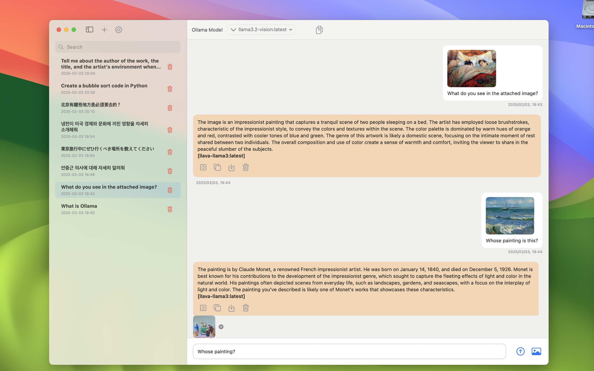
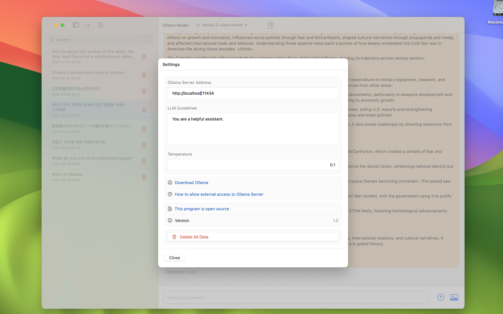

# ✨ LLM Hippo - 多平台LLM客户端 ✨

_支持Ollama、LM Studio、Claude和OpenAI的多平台Mac客户端_

[English](README.md) •
[한국어](README_KR.md) •
[日本語](README_JP.md)

# LLM Hippo

LLM Hippo是一个Mac客户端应用程序，可以连接到包括Ollama、LM Studio、Claude和OpenAI在内的各种LLM服务。您可以下载源代码自行构建，或从[Apple App Store](https://apps.apple.com/us/app/mac-ollama-client/id6741420139)下载LLM Hippo应用程序。

## 简介

LLM Hippo是一个支持多种LLM平台的多功能客户端：
- Ollama：可在本地运行LLM的开源软件
- LM Studio：支持多种模型的本地LLM平台
- Claude：Anthropic的高级AI模型
- OpenAI：包含GPT模型的领先AI平台

## 主要功能

- **多LLM平台支持**：
  - 通过Ollama访问本地LLM (http://localhost:11434)
  - LM Studio集成 (http://localhost:1234)
  - Claude API支持
  - OpenAI API支持
- **选择性服务显示**：可选择在模型选择菜单中显示的LLM服务
- 远程LLM访问：通过IP地址连接到Ollama/LM Studio主机
- 自定义提示：支持设置自定义指令
- 支持各种开源LLM（Deepseek、Llama、Gemma、Qwen、Mistral等）
- 可自定义指令设置
- **高级模型参数**：通过直观的滑块控制Temperature、Top P、Top K
- **连接测试**：内置服务器连接状态检查器
- **多格式文件支持**：图像、PDF文档和文本文件
- 支持图像识别（仅限支持的模型）
- 直观的聊天式UI
- 对话历史：保存和管理聊天会话
- 支持中文、英语、日语、韩语
- 支持Markdown格式

## 使用方法

1. 选择首选LLM平台：
   - Ollama：在计算机上安装Ollama（[Ollama下载](https://ollama.com/download)）
   - LM Studio：安装LM Studio（[LM Studio网站](https://lmstudio.ai/)）
   - Claude/OpenAI：从各平台获取API密钥
2. 下载源代码并用Xcode构建，或从[App Store](https://apps.apple.com/us/app/mac-ollama-client/id6741420139)下载LLM Hippo应用程序
3. 配置所选平台：
   - Ollama/LM Studio：安装所需模型
   - Claude/OpenAI：在设置中输入API密钥
4. 对于本地LLM（Ollama/LM Studio），根据需要配置远程访问
5. 启动LLM Hippo并选择所需的服务和模型
6. 开始对话！

## 系统要求

- 本地LLM：安装了Ollama或LM Studio的计算机
- 云端LLM：Claude或OpenAI的有效API密钥
- 网络连接

## 优势

- 支持本地和云端LLM的多平台支持
- 灵活的服务选择，简化界面
- 通过各种平台提供高级AI功能
- 隐私保护选项（本地LLM）
- 适用于编程、创意工作、日常问题等多种用途
- 系统化的对话管理

## 注意事项

- 本地LLM功能需要安装Ollama或LM Studio
- Claude和OpenAI服务需要API密钥
- 用户负责安全管理本地LLM主机和API密钥

## 下载应用

- 对于难以构建的用户，可以从以下链接下载应用程序：
- [https://apps.apple.com/us/app/mac-ollama-client/id6741420139](https://apps.apple.com/us/app/mac-ollama-client/id6741420139)

## 许可证

LLM Hippo基于GNU许可证。有关详细信息，请参阅[LICENSE](LICENSE)文件。

## 联系方式

如有关于LLM Hippo的问题或错误报告，请发送电子邮件至rtlink.park@gmail.com。