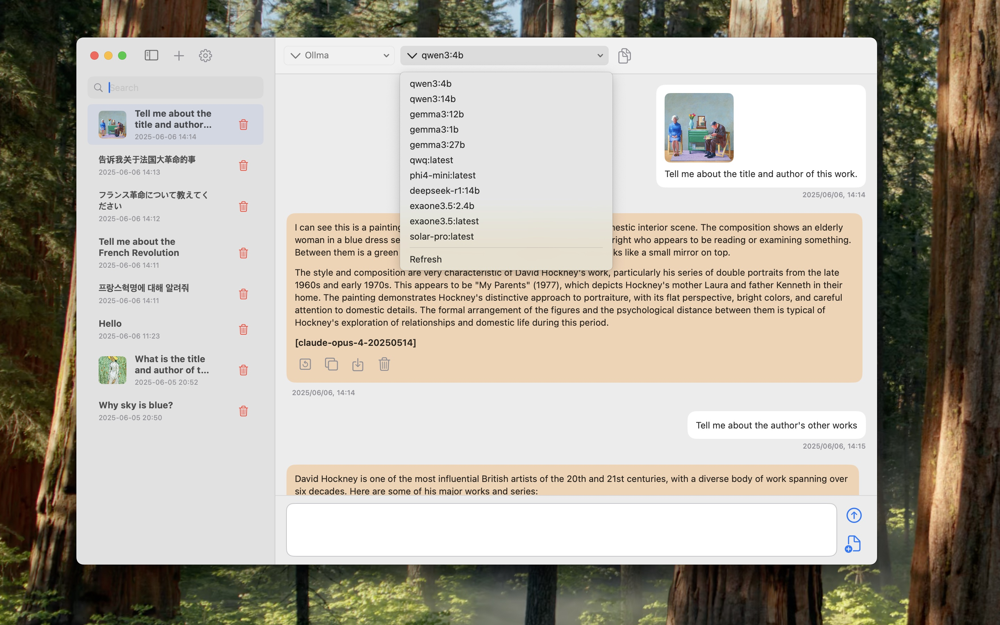
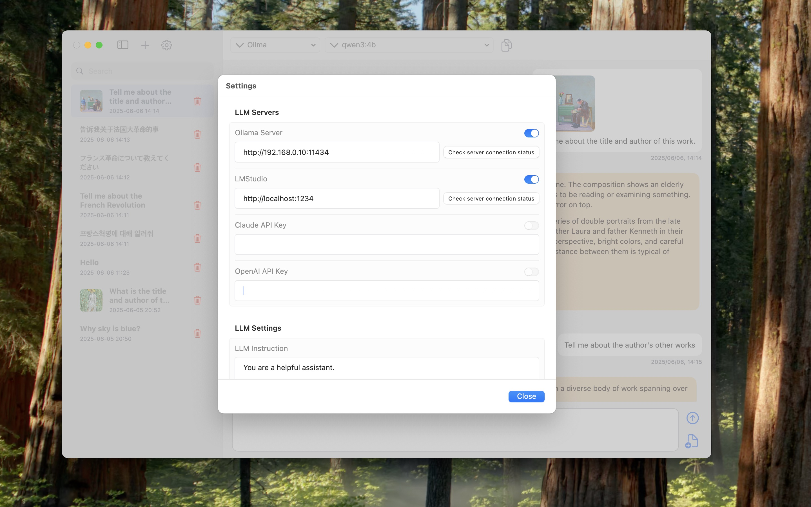

# ✨ LLM Hippo - Mac 用 Ollama クライアント ✨

_Ollama-based LLM Mac client_

[ENGLISH](README.md) •
[한국어](README_KR.md) •
[日本語](README_JP.md) •
[中文](README_CH.md)

# LLM Hippo

LLM Hippo は、Ollama がインストールされているコンピュータに接続して大規模言語モデル（LLM）と対話できる Mac クライアントアプリです。ソースコードをダウンロードしてビルドするか、[Apple App Store](https://apps.apple.com/us/app/mac-ollama-client/id6741420139)から LLM Hippo アプリをダウンロードできます。

## はじめに

Ollama は、ローカルコンピュータで大規模言語モデル（LLM）を簡単に実行できるオープンソースソフトウェアです。
LLM Hippo を使用して Ollama にアクセスし、さまざまな LLM を活用できます。 MyOllama - Ollama プログラムを使用すると、自分のコンピュータで LLM を実行して、有料なしで AI モデルと対話できます。

## 主な機能

- ローカル LLM アクセス: ローカル LLM 接続 http://localhost:11434
- リモート LLM アクセス: IPアドレスでOlamaホストに接続します。
- カスタムプロンプト: カスタムコマンドの設定サポート
- 様々なオープンソース LLM(Deepseek, Llama, Gemma, Qwen, Mistral など)をサポート。
- カスタム LLM ガイドラインの設定
- 画像認識対応(対応機種に限る)
- 直感的なチャット型 UI
- 会話履歴：チャットセッションの保存と管理
- 韓国語、英語、日本語、中国語に対応
- マークダウン形式をサポート

## 使い方

1. コンピュータにオラマをインストールします（MacOS、Windows、Linuxのサポート）。Ollama のインストール方法は [Ollama の旗ハブ](https://ollama.com/download)で確認できます。
2. ソースをダウンロードして Xcode でビルドするか、[App Store](https://apps.apple.com/us/app/my-ollama/id6738298481) から MyOllama アプリをダウンロードします。
3. Ollama に目的のモデルを取り付けます。 [モデルダウンロード](https://ollama.com/search)
4. Ollama からリモートでアクセスできるように設定を変更します。参照：[リンク](http://practical.kr/?p=809)
5. MyOllama アプリを起動し、Ollama がインストールされているコンピュータのIPアドレスを入力します。
6. 目的の AI モデルを選択し、会話を開始します。

## システム要件

- Ollama がインストールされたコンピュータ
- ネットワーク接続

## 利点

- オープンソース LLM を効率的に活用したい開発者や研究者向けに設計されたアプリです。 API 呼び出し、プロンプトエンジニアリング、モデルパフォーマンステストなど、さまざまな技術実験に活用できます。
- 無料で提供される高度な AI 機能
- 様々な LLM モデルをサポート
- 個人情報保護（ローカルコンピュータで実行）
- プログラミング、創作作業、日常的な質問などに多目的に使用可能。
- 会話内容を文脈に合わせて整理

## 注

- このアプリを使用するには、Ollama がインストールされているコンピュータが必要です。
- オラマホストを設定して管理する責任はユーザー自身にあります。セキュリティ設定に注意してください。

## アプリのダウンロード

- 構築に苦労している人は、以下のリンクからアプリをダウンロードできます。
- [https://apps.apple.com/us/app/mac-ollama-client/id6741420139](https://apps.apple.com/us/app/mac-ollama-client/id6741420139)

## ライセンス

MyOllama は GNU ライセンスに基づいてライセンスされています。詳しくは、[LICENSE](ライセンス) ファイルをご覧ください。

## 連絡先

MyOllama に関する質問やバグを報告するには、rtlink.park@gmail.com に電子メールを送ってください。
